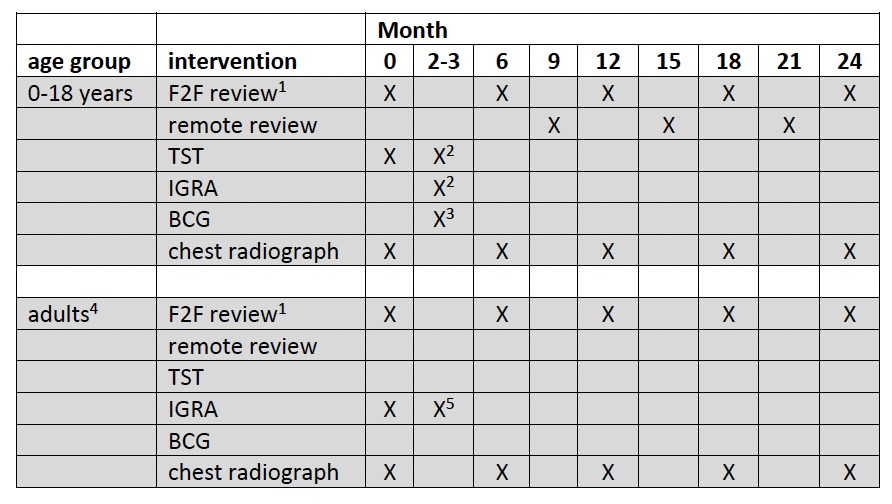

  
  
  

## Contents 
[Links](#links)  
[Introduction](#intro)   
[Getting Started](#getstarted)  
[Data Protection](#dataprotection)  
[Sites involved in this study](#sitesinvolved)  

## Links 
[Homepage](/index.md)   
[MDR TB contacts registry](https://mdrtb-contacts.lshtm.ac.uk/)  
[Protocol](/protocol/MDRTBcontactsRegistry_Protocol.pdf)   
[Ethics Approvals](/ethics)  
[Setup instructions](/howto.md). 
[Consent Process](/consent.md)  
[Consent Forms](/consent)  
[Follow-up schedules](/followup.md)  
[Data Protection Impact Assessment](//DPIA/dpia.pdf)  
[HRA Approvals](/HRA_approval_documents)  

## MDRTB contacts registry – follow-up schedule  
  
    
  
### Recording of investigations and interventions by visit SOP  

The purpose of the MDRTB contacts registry project is to facilitate capture and follow-up of 
MDR-TB exposed household contacts by clinics. As such the DHIS2 online tool permits
completion of entries at multiple timepoints but does not force any visit frequency.
Similarly, although the table below describes an approach arrived at after a local Delphi
process in north London following a review of the literature, the investigations and
interventions conducted at each timepoint are not proscribed. Rather the DHIS-2 tool
provides a mechanism for recording and reviewing your clinic practice against your intended
local practice.  

Summary of guidance from national and international agencies  

1. Follow-up  

a. Regardless of decisions around preventive therapy there is a coalescence around a recommendation for 24 months of follow-up, at least six-monthly, following a baseline screen  

b. Recommendations for baseline screening generally include clinical review, chest radiography, testing for LTBI, and microbiological sampling if clinically indicated (if contact is symptomatic)  

c. There is no consistent recommendation on the nature of follow-up (symptom screen, clinical examination, chest radiography, sampling)  

2. Preventive therapy  

a. Guidelines that make recommendations for PT only do so for contacts with demonstrated LTBI (positive IGRA or TST) and no evidence of active TB disease  

b. Decisions about PT should be made on a case-by-case basis  

c. WHO recommends PT be considered for high-risk household contacts (children and immunosuppressed adults) based on risk assessment and clinical judgement  

d. Fluoroquinolones are considered an important component of any PT regimen  

e. There is no single recommended PT regimen; most studies report the use of 2-3 agents for 6-12 months  

  
A draft strategy for MDRTB contact management, drawing upon these principles, was circulated amongst adult and paediatric TB physicians, and iterated according to feedback discussions. The tables below outline the consensus view on frequency and nature of review for adults and children exposed to MDRTB within the household, whether the index case has pulmonary or extrapulmonary disease. The same approaches might also be considered suitable for close contact exposure with pulmonary MDRTB outside the household.  

  

      
        
          
1 “Review” encompasses history taking to detect early active TB disease – when F2F this can also include clinical examination. Remote review will usually be a telephone consultation. Sampling for microbiological testing to be driven by symptoms.  
2 2-3 month visit after baseline assessment for repeat TST and IGRA, only if initial TST is negative  
3 BCG to be given after 2-3 month visit if initial TST and repeat TST and IGRA all negative  
4 same follow-up for immunocompetent and immunosuppressed  
5 repeat IGRA performed at 2-3 months only if baseline negative (to capture late converters)  

