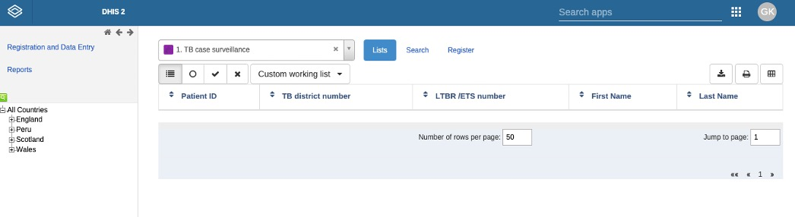
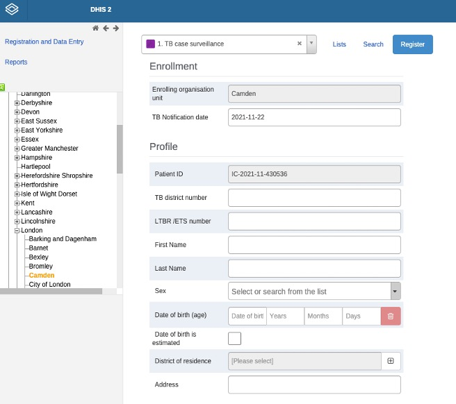
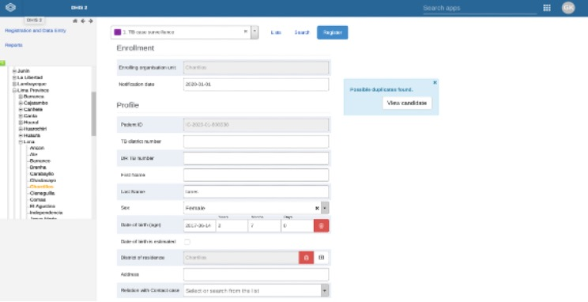
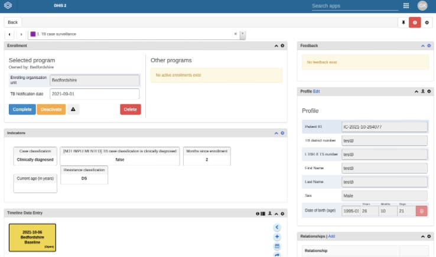

  
  
  

## Contents 
[Links](#links)  
[Introduction](#intro)   
[Getting Started](#getstarted)  
[Data Protection](#dataprotection)  

## Links 
[Homepage](/index.md)   
[MDR TB contacts registry](https://mdrtb-contacts.lshtm.ac.uk/)  
[Protocol](/protocol/MDRTBcontactsRegistry_Protocol.pdf)   
[Ethics Approvals](/ethics.md)  
[Setup instructions](/howto.md)   
[Consent Process](/consent.md)  
[Consent Forms](/consentforms.md)  
[Follow-up schedules](/followup.md)  
[Data Protection Impact Assessment](/DPIA/dpia.pdf)  
[HRA Approvals](HRA_approvals.md)  

## How to guide 

### MDRTB contact registry  

Registration of a new MDRTB case or a contact in DHIS2  

Please make sure   
* Each time you open the website you enter your own personal login data.  
* Set up two factor authentication on your first log in. The study team will take you through this.  
* Each time you close the browser window, you log out instead of closing the page or browser.  
* Failure to do so is a security risk.  

An Internet connection is required.  

### Using DHIS2  

Enter the web address into the search navigator https://mdrtb-contacts.lshtm.ac.uk/  

    

 

    
    
    

Enter your username, password and select ‘login using two-factor authentication’.  

    
    

- You will need the authenticator application on your phone to provide the two-factor authentication.  

- Use your mobile NHS authenticator to generate a login code.  

- If you do not have this installed on your phone download it for free via the iPhone App store or Google Play store. 

- If you are not used to using this, please contact us and we will explain during your training session.  

Sign in  

Once connected, the dashboard will be visible:  
  
     

   

To log out, click on the profile tab (with your initials) at the top right of the screen.  
  
This dashboard displays real-time, aggregated, anonymised data that has been entered. 
Currently there are two dashboards. 
One for the index patients and one for the contacts. 
You can move between them by selecting the tabs at the top. 
We can add and change them according to our needs. 
Each user can select what to see on their dashboard and there are a range of graphs available.
  
    

To the left of the profile tab there is a search function called "search applications" highlighted here:  
    
  

Select “search applications” and a drop-down menu with applications will appear. 
  
Select the tracker capture that looks like a notepad and pencil, this opens the data entry window.  
  
    
  
The "tracker capture application" will appear on your screen:

    
     
    

On the left hand side of the thumbnail section the "organisation" hierarchy will be displayed.  

This is the list of countries, regions, districts and sub-districts within the application.    
  
You should see All countries: England, Wales, Scotland. Select your country and a drop-down menu of counties appears, please choose the local authority in which your index patient lives by following the correct region, county, local area.    
  
Once you are in the correct district, the format of the screen changes and you can see two options to choose from in the Lists tab, either TB case surveillance or Contact tracing program.

### Registering participants

Order of steps to follow when first registering participants  
  
1.	When registering an index patient and their contacts for the first time, always start with the index.  
2.	Complete all baseline questions for the index patient before registering the contacts for that index patient.   
3.	Once you have registered both the index and their contact, you can form a relationship link between the two on the system (described later).  

 
    

    
    
     

To first register their index patient with MDR TB, choose the TB case surveillance option.   

Then click on register to enrol a participant.  
  
The following form, called "registration", will open. Please complete all sections for the MDR TB index patient. Two answers are automatically filled in for you. The enrolment district and the patient ID. The patient ID is the participant's study number. 

You will get the participant study number for each index and contact case once you have registered them in the DHIS2 application.   

The participant study number generated will be unique to each participant and is generated using the date, clinic location, and a unique number for each index participant. Please note that the index study number and their contacts’ study numbers will not be numerically linked - linkage will be explained in this document.   
  
The index patient section has been developed in line with the current WHO DHIS2 TB case surveillance platform.  

  

    

    The TB clinic name is the name of the treating health centre.
  
    The NTBS number is the unique number given to the TB patient by the TB programme.
    
    Do not leave any answers blank. If you do, you will not be able to proceed to the next step.  
     

If the index patient’s details are similar to another previously entered case, a blue box will appear warning you about a possible duplication. Please enter all patient details and then check if the possible duplicate is an exact match by clicking on "view candidate".  
    

   

    There should be no duplicate MDRTB index patients   
    If there is an exact match, please recheck the patient details 
    If a patient experiences a 2nd episode of MDRTB this can be recorded as another episode under the same patient  

    

  

Once you have completed the registration form correctly for the MDR TB index patient, choose confirm and continue.   

Once you have entered all personal data, confirm it is correct then select confirm and continue.  

    
     
    

When the confirmation button is pressed, the following MDRTB index patient home screen will appear:   

   

On the home screen you will see    
  
  
* the programme the patient is enrolled in   
* their profile   
* their relationships with other participants  
* the indicators their data will populate for display on dashboards   
* their data entry forms in a timeline  

    
    
    

### Index case registration  

For initial registration there are four forms to complete for each index:  

1.	Baseline data  
2.	Treatment  
3.	Laboratory results  
4.	Drug susceptibility test results  

The following list includes all the data required for the index case and is taken from our study materials and the images are screenshots of all the variables you need to include.  

●	MDR tuberculosis notification date  
●	Index case identification code    
●	Total number of contacts in the household    
●	Date of birth  
●	Age  
●	Sex  
●	Address  
●	Contact's telephone number  
●	District of residence  
●	MDR Treatment start date  
●	Sputum test result and date of result   
●	Degree of sputum smear positivity  
●	TB culture result  
●	Xpert result  
●	Drug resistance  
●	Chest radiograph changes  
●	Social risk factors   
●	Previous Treatment courses  
  
To enter one of the four forms, select the plus sign on the right-hand side of the timeline data entry section, select the form you want to load into the timeline, then ensure the box in the timeline is selected (turns yellow) so you can answer the questions within this section.   
  
  
First complete the baseline data entry form. When you select the box, the following screen appears:    
  

  

	Please answer all questions. You will not be able to progress to the next step unless you do so

	Once all sections are complete, select "complete"

	This generates a TB case surveillance report    

    

 

A box will appear asking if the form is complete. Choose complete and close  
 
The sections on laboratory data, treatment outcome, and drug sensitivity testing can be completed at a later date. None of these are mandatory.  

    
   
    
 
The following screen will appear with the newly entered patient in the list:  

  
  
    
    
    

To add the remaining forms (Laboratory forms, treatment and DST) to this index select your patient.  
Repeat the process of adding forms within the "timeline data entry" by selecting the plus sign "+".  

    

This screen will appear.  

  
  
Here you will be able to add lab, treatment, and DST forms  
        
You can return to this and add forms later, once results are available  

    
    
    
    

### Contact case registration

Once you have registered an index patient, return to the previous screen by selecting the back button at the top left of the screen.  
You can now register the first contact for this index.  

  

    

* Ensure you are in the correct local borough from the list on the left  
* Select the Contact tracing Programme from the drop-down list as shown here  
* Select register  

Complete this registration form, the form will only save once complete.  
The contact participant's study ID will auto-generate.  

  

Information that needs to be entered:  
  
●	Patient's last name  
●	Patient's first name  
●	Date of birth (Age)  
●	Sex  
●	Home district   
●	Contact phone number  
●	Location of residence (type the local authority into the search bar)  
●	Location of contact with index case  
●	Relationship to index case  
●	Proximity to index case  
  
Select save  
  
The contacts home page will open with a timeline for follow up  
  
  

On the home screen you will see:  

●	program registration details  
●	the contact profile  
●	their relationships with other participants  
●	the indicators their data will populate for display on dashboards   
●	their data entry forms in a timeline  

  
### Timeline Data entry  

Within the timeline data entry, you should see the data capture forms for each time point Month 0 (M0), Month 3 (M3), Month 6 (M6), Month 12 (M12), Month 18 (M18) , and Month 24 (M24).   

If you cannot see them, they need to be added.   
To add a data capture form, select the + button to the right of the timeline data entry box.   
Select “Add New” 
First select screening visit M0  
To add additional timepoint reviews you can select the “additional review” form.  

   

    

A screen opens allowing you to set the "assessment date" and the "organisational unit" (meaning the district in which the participant lives).  
Select next.  
You will need to do this for each data entry form you add.  

### Baseline visit M0  

Information to be entered:  

●	Are there any known risk factors?   
●	Previous TB treatment  
●	Previous TB preventive treatment  
●	Duration of exposure (to a symptomatic index) in weeks  
●	MDRTB treatment initiation date of the index  

  

Select all radio buttons relevant for the current contact  

  

	Enter the number of weeks of exposure to a symptomatic index   
	
	Enter Sputum samples and Chest X-ray results once available.  
	
Remind your contact that they will be screened for 2 years, give them a guide on TB symptoms and how to seek help, and give them a card with contact information.  
  
When the form is complete, select complete.  

Add forms M3, M6, M12, M18 and M24 to the contact's dashboard. The dates on these forms are automatically filled in, but you can change them to a date you agree with the contact. You can add additional review forms for reviews at other time points, for example a remote review in paediatrics at 9 months.  

### Follow up visits  
  
When you review this contact at the next visit, make sure to return to the same contact to enter the next data capture form (M3, M6 etc). To do this you can find a list of contact participant IDs under the borough within the Contact tracing program. Ensure you know which participant ID is linked to each contact.  
  
Once you have entered the index case and the contact case it is important to link them by entering a “relationship”.  
  

### Adding a relationship  

  

    
    
    

Within the relationship box select the "add" button. A window will open showing a box asking you to add a relationship.  
     

  

    

	From the drop-down menu, select the contact index case   
	A new window will open with your contact and the list of index patients already entered in the system  
	
   

    
 
 	Here you can see the details of your contact participant on the left of the screen  
 	On the right you can search for index TB patients using demographic data  
 	Select the index MDRTB patient of your contact participant   
 
    
 The following screen will appear. Select "save" if you are happy that this is the correct index patient.
     
 
   

You should now see a link within the relationship box on the main page of your contacts.  

Once you have completed all the fields, you will find a box at the bottom left of the screen (scroll down) that says "complete" in yellow. Select this option to complete data entry and save the data. If the data is incomplete, you will see a warning message and you will have to go back and complete the empty fields.  
  
Before leaving the contact, make sure you know the date of your next M3 or M6 follow-up and plan with them where and how it will be (by phone/home person/other location).   

 

