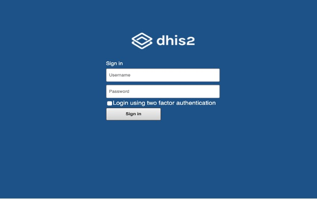
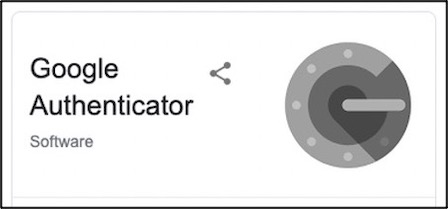
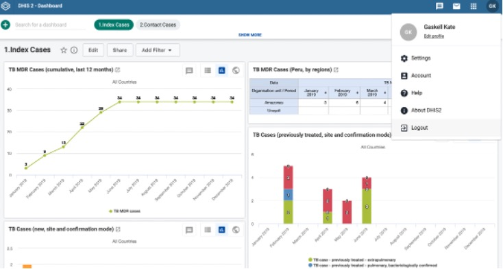
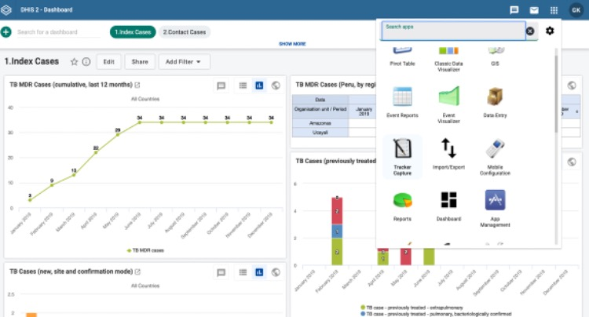
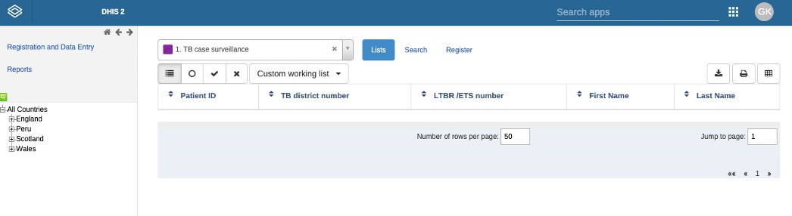
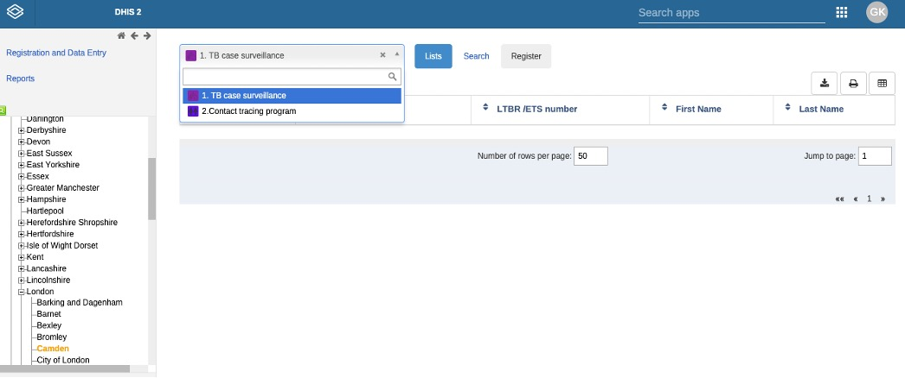
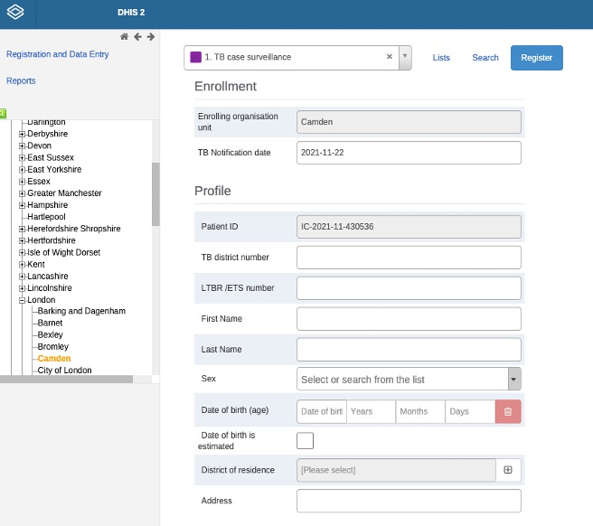
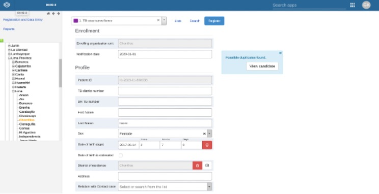
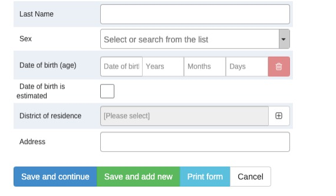
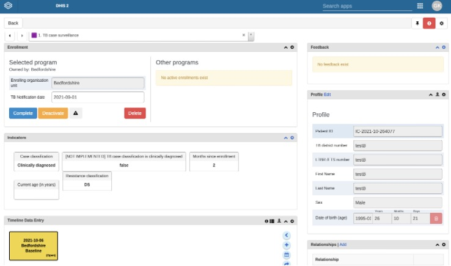

  
  
  

## Contents 
[Links](#links)  
[Introduction](#intro)   
[Getting Started](#getstarted)  
[Data Protection](#dataprotection)  
[Sites involved in this study](#sitesinvolved)  
[How to guide](#howtoguide)
 

## Links 
[MDR TB contacts registry](https://mdrtb-contacts.lshtm.ac.uk/)  
[Protocol](/protocol/MDRTBcontactsRegistry_Protocol.pdf)   
[How to guides](/howtoguides)   
[Ethics Approvals](/ethics)  
[Consent Forms](/consentandPIS)  
[Data Protection Impact Assessment](//DPIA/dpia.pdf)  
[HRA Approvals](/HRA_approval_documents)  

## Introduction 

This is a resource for the MDRTB contacts registry UK study

It includes all the information you will need to set up a study site

It is open access for all interested UK MDR TB services to view the training resources and decide whether to participate

The MDRTB contacts registry can be accessed once your site is live and you've received the 10 minute training session

Many thanks for your interest and we look forward to working with you

Dave Moore & Kate Gaskell

## Getting started 

<iframe title="vimeo-player" src="https://player.vimeo.com/video/647248714?h=fb0c53afa1" width="640" height="360" frameborder="0" allowfullscreen></iframe>

To join the study you will need the following

1. Local ethical approval
  * To do this you need to complete:
    * The organisation information document_V1 [OID](/HRA_approval_documents/MDRTBcontactsregistry_Organisation_Information_Document.docx) IRAS form. You can find this in the folder named HRA approval documents for each site.
   	 	
   	   	* 	To complete this you need signatures from:
      	* 	A local PI (a lead TB clinician on site)
       	* 	A local point of contact for the LSHTM sponsor. If the NHS site has a Research and Development Office (R&D), Contract Research Organisation (CRO) or Clinical Trials Unit (CTU) it should be a contact at the R&D/CRO/CTU. If these do not exist this can be a study sponsor, study manager, study coordinator or clinical research scientist.
    
    * Amend the OID to reference your site only
    * Amend the [IRAS schedule of events](/HRA_approval_documents/IRAS_scheduleofevents.xls) to ensure it is site specific. You can find this in the folder named HRA approval documents for each site.
    * Complete a delegation log [Delegation Log](/HRA_approval_documents/MDRTB_CONTACTS_REGISTRY_DELEGATION_LOG.docx) (after training has been completed)
    * Submit all these forms to your local R&D and make sure you copy us in at david.moore@lshtm.ac.uk and kate.gaskell@lshtm.ac.uk
    
2. Ensure you have up to date Good Clinical Practice training. There are a few online refresher training courses, of which you can access one [here](https://globalhealthtrainingcentre.tghn.org/elearning/).

3. Once you have submitted these forms to your R&D and accessed the training documents, we will arrange training to access the contact registry at https://mdrtb-contacts.lshtm.ac.uk/

## Data Protection 

We have performed a Data Protection Impact Assessment at LSHTM which you can access [here](/DPIA/dpia.pdf).   
The LSHTM privacy notice which you can access [here](https://www.lshtm.ac.uk/files/research-participant-privacy-notice.pdf).  

We have HRA approval for all MDR TB commissioned centres in England who have shown interest in participating.   
We are applying for approval for sites in Wales and Scotland.

   
## Sites involved in this study   

* Barts Health NHS Trust
* Bradford Teaching Hospitals NHS FT
* Cambridge University Hospitals NHS FT
* Central Manchester University and North Manchester Hospitals NHS Trusts
* Heart of England FT, East Lancashire Hospitals NHS FT 
* Guy's and St Thomas NHS FT 
* Hull and East Yorkshire Hospitals NHS Trust
* Imperial College Healthcare NHS Trust
* Leeds Teaching Hospitals NHS Trust
* Lewisham and Greenwich NHS Trust
* London Northwest Healthcare
* North Bristol NHS Trust
* Nottingham University Hospitals NHS Trust
* Oxford University Hospitals NHS Trust
* Royal Free London NHS Foundation Trust
* Royal Liverpool and Broadgreen University Hospitals NHS Trust
* Sandwell and West Birmingham NHS Trust
* Sheffield Teaching Hospitals NHS Foundation Trust
* St George's Hospital London
* The Newcastle upon Tyne Hospitals NHS FT
* Whittington Health North Central London TB service London

## How to guide 

##MDRTB contact registry  

Registration of a new MDRTB case or a contact in DHIS2  

Please make sure   
* Each time you open the website you enter your own personal login data.  
* Set up two factor authentication on your first log in. The study team will take you through this.  
* Each time you close the browser window, you log out instead of closing the page or browser.  
* Failure to do so is a security risk.
  
An Internet connection is required.
  
  
##Using DHIS2  

Enter the web address into the search navigator https://mdrtb-contacts.lshtm.ac.uk/  

  
Enter your username, password and select ‘login using two-factor authentication’. You will need the
authenticator application on your phone to provide the two-factor authentication.  

Use your mobile NHS authenticator to generate a login code.

  
If you do not have this installed on your phone download it for free via the iPhone App store or Google Play store. 

If you are not used to using this, please contact us and we will explain during your training session. 
  
Sign in  
  
  
  
Once connected, the dashboard will be visible:  
  

  
To log out, click on the profile tab (with your initials) at the top right of the screen.  
  
This dashboard displays real-time, aggregated, anonymised data that has been entered. Currently there are two dashboards. One for the index patients and one for the contacts. You can move between them by selecting the tabs at the top. We can add and change them according to our needs. Each user can select what to see on their dashboard and there are a range of graphs available.
  
  
  
  
To the left of the profile tab there is a search function called "search applications" highlighted here:
    
  
  
Select “search applications” and a drop-down menu with applications will appear. 
  
Select the tracker capture that looks like a notepad and pencil, this opens the data entry window.  
  
The "tracker capture application" will appear on your screen:

     

  
On the left hand side of the thumbnail section the "organisation" hierarchy will be displayed.  
    
  
    

This is the list of countries, regions, districts and sub-districts within the application.    
  
You should see All countries: England, Wales, Scotland. Select your country and a drop-down menu of counties appears, please choose the local authority in which your index patient lives by following the correct region, county, local area.    
  
Once you are in the correct district, the format of the screen changes and you can see two options to choose from in the Lists tab, either TB case surveillance or Contact tracing program.

##Registering participants

Order of steps to follow when first registering participants  
  
1.	When registering an index patient and their contacts for the first time, always start with the index.  
2.	Complete all baseline questions for the index patient before registering the contacts for that index patient.   
3.	Once you have registered both the index and their contact, you can form a relationship link between the two on the system (described later).  

    

To first register their index patient with MDR TB, choose the TB case surveillance option.   

Then click on register to enrol a participant.  
  
The following form, called "registration", will open. Please complete all sections for the MDR TB index patient. Two answers are automatically filled in for you. The enrolment district and the patient ID. The patient ID is the participant's study number. 

You will get the participant study number for each index and contact case once you have registered them in the DHIS2 application.   

The participant study number generated will be unique to each participant and is generated using the date, clinic location, and a unique number for each index participant. Please note that the index study number and their contacts’ study numbers will not be numerically linked - linkage will be explained in this document.   
  
The index patient section has been developed in line with the current WHO DHIS2 TB case surveillance platform.  
  
  
  
  
    The TB clinic name is the name of the treating health centre.
  
  
    The NTBS number is the unique number given to the TB patient by the TB programme.
    
    Do not leave any answers blank. 
    If you do, you will not be able to proceed to the next step.  
     

  
If the index patient’s details are similar to another previously entered case, a blue box will appear warning you about a possible duplication. Please enter all patient details and then check if the possible duplicate is an exact match by clicking on "view candidate".

   

    There should be no duplicate MDRTB index patients.   
    If there is an exact match, please recheck the patient details. 
    

If a patient experiences a 2nd episode of MDRTB this can be recorded as another episode under the same patient  

  

Once you have completed the registration form correctly for the MDR TB index patient, choose confirm and continue.   

Once you have entered all personal data, confirm it is correct then select confirm and continue.
When the confirmation button is pressed, the following MDRTB index patient home screen will appear:  

    

On the home screen you will see:   
  
  
* the programme the patient is enrolled in   
* their profile   
* their relationships with other participants  
* the indicators their data will populate for display on dashboards   
* their data entry forms in a timeline

##Index case data   

For initial registration there are four forms to complete for each index:  

1.	Baseline data  
2.	Treatment  
3.	Laboratory results  
4.	Drug susceptibility test results  

The following list includes all the data required for the index case and is taken from our study materials and the images are screenshots of all the variables you need to include.  

●	MDR tuberculosis notification date  
●	Index case identification code    
●	Total number of contacts in the household    
●	Date of birth  
●	Age  
●	Sex  
●	Address  
●	Contact's telephone number  
●	District of residence  
●	MDR Treatment start date  
●	Sputum test result and date of result   
●	Degree of sputum smear positivity  
●	TB culture result  
●	Xpert result  
●	Drug resistance  
●	Chest radiograph changes  
●	Social risk factors   
●	Previous Treatment courses  
  
To enter one of the four forms, select the plus sign on the right-hand side of the timeline data entry section, select the form you want to load into the timeline, then ensure the box in the timeline is selected (turns yellow) so you can answer the questions within this section.   
  
  
First complete the baseline data entry form. When you select the box, the following screen appears:  

