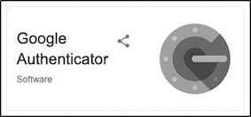

  
  
  

## Contents 
[Links](#links)  
[Introduction](#intro)   
[Getting Started](#getstarted)  
[Data Protection](#dataprotection)  
[Sites involved in this study](#sitesinvolved)  
[How to guide](#howtoguide)
 

## Links. 
[MDR TB contacts registry](https://mdrtb-contacts.lshtm.ac.uk/)  
[Protocol](/protocol/MDRTBcontactsRegistry_Protocol.pdf)   
[How to guides](/howtoguides)   
[Ethics Approvals](/ethics)  
[Consent Forms](/consentandPIS)  
[Data Protection Impact Assessment](//DPIA/dpia.pdf)  
[HRA Approvals](/HRA_approval_documents)  

## Introduction 

This is a resource for the MDRTB contacts registry UK study

It includes all the information you will need to set up a study site

It is open access for all interested UK MDR TB services to view the training resources and decide whether to participate

The MDRTB contacts registry can be accessed once your site is live and you've received the 10 minute training session

Many thanks for your interest and we look forward to working with you

Dave Moore & Kate Gaskell

## Getting started 

<iframe title="vimeo-player" src="https://player.vimeo.com/video/647248714?h=fb0c53afa1" width="640" height="360" frameborder="0" allowfullscreen></iframe>

To join the study you will need the following

1. Local ethical approval
  * To do this you need to complete:
    * The organisation information document_V1 [OID](/HRA_approval_documents/MDRTBcontactsregistry_Organisation_Information_Document.docx) IRAS form. You can find this in the folder named HRA approval documents for each site.
   	 	
   	   	* 	To complete this you need signatures from:
      	* 	A local PI (a lead TB clinician on site)
       	* 	A local point of contact for the LSHTM sponsor. If the NHS site has a Research and Development Office (R&D), Contract Research Organisation (CRO) or Clinical Trials Unit (CTU) it should be a contact at the R&D/CRO/CTU. If these do not exist this can be a study sponsor, study manager, study coordinator or clinical research scientist.
    
    * Amend the OID to reference your site only
    * Amend the [IRAS schedule of events](/HRA_approval_documents/IRAS_scheduleofevents.xls) to ensure it is site specific. You can find this in the folder named HRA approval documents for each site.
    * Complete a delegation log [Delegation Log](/HRA_approval_documents/MDRTB_CONTACTS_REGISTRY_DELEGATION_LOG.docx) (after training has been completed)
    * Submit all these forms to your local R&D and make sure you copy us in at david.moore@lshtm.ac.uk and kate.gaskell@lshtm.ac.uk
    
2. Ensure you have up to date Good Clinical Practice training. There are a few online refresher training courses, of which you can access one [here](https://globalhealthtrainingcentre.tghn.org/elearning/).

3. Once you have submitted these forms to your R&D and accessed the training documents, we will arrange training to access the contact registry at https://mdrtb-contacts.lshtm.ac.uk/

## Data Protection 

We have performed a Data Protection Impact Assessment at LSHTM which you can access [here](/DPIA/dpia.pdf).   
The LSHTM privacy notice which you can access [here](https://www.lshtm.ac.uk/files/research-participant-privacy-notice.pdf).  

We have HRA approval for all MDR TB commissioned centres in England who have shown interest in participating.   
We are applying for approval for sites in Wales and Scotland.

   
## Sites involved in this study   

* Barts Health NHS Trust
* Bradford Teaching Hospitals NHS FT
* Cambridge University Hospitals NHS FT
* Central Manchester University and North Manchester Hospitals NHS Trusts
* Heart of England FT, East Lancashire Hospitals NHS FT 
* Guy's and St Thomas NHS FT 
* Hull and East Yorkshire Hospitals NHS Trust
* Imperial College Healthcare NHS Trust
* Leeds Teaching Hospitals NHS Trust
* Lewisham and Greenwich NHS Trust
* London Northwest Healthcare
* North Bristol NHS Trust
* Nottingham University Hospitals NHS Trust
* Oxford University Hospitals NHS Trust
* Royal Free London NHS Foundation Trust
* Royal Liverpool and Broadgreen University Hospitals NHS Trust
* Sandwell and West Birmingham NHS Trust
* Sheffield Teaching Hospitals NHS Foundation Trust
* St George's Hospital London
* The Newcastle upon Tyne Hospitals NHS FT
* Whittington Health North Central London TB service London

## How to guide 

MDRTB contact registry  

Registration of a new MDRTB case or a contact in DHIS2  

Please make sure   
* Each time you open the website you enter your own personal login data.  
* Set up two factor authentication on your first log in. The study team will take you through this.  
* Each time you close the browser window, you log out instead of closing the page or browser.  
* Failure to do so is a security risk.
  
An Internet connection is required.
  
  
DHIS2  

Enter the web address into the search navigator https://mdrtb-contacts.lshtm.ac.uk/  

Enter your username, password and select ‘login using two-factor authentication’. You will need the
authenticator application on your phone to provide the two-factor authentication.  

Use your mobile NHS authenticator to generate a login code.

  
If you do not have this installed on your phone download it for free via the iPhone App store or Google Play store. 

If you are not used to using this, please contact us and we will explain during your training session. 
  
Sign in

